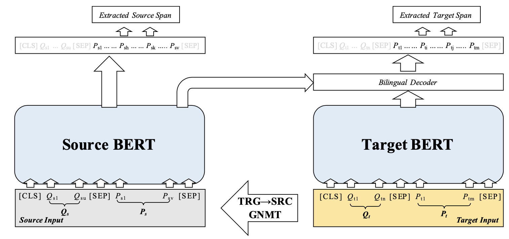

[**中文说明**](./README_CN.md) | [**English**](./README.md)

# Cross-Lingual Machine Reading Comprehension
This repository contains resources of the following [EMNLP-IJCNLP 2019](https://www.emnlp-ijcnlp2019.org) paper.  

**Title: Cross-Lingual Machine Reading Comprehension**    
Authors: Yiming Cui, Wanxiang Che, Ting Liu, Bing Qin, Shijin Wang, Guoping Hu  
Link: [https://arxiv.org/abs/1909.00361](https://arxiv.org/abs/1909.00361)



## Directory Guide
```
root_directory
    |- src    # contains source codes for Dual BERT
    |- data   # Chinese-English (translated) bilingual datasets
```

## Requirements
```
Python 2.7  
TensorFlow 1.12  
```

## Performance

### [CMRC 2018](https://hfl-rc.github.io/cmrc2018/open_challenge/)
| Model | Dev | Test | Challenge |
| :------- | :---------: | :---------: | :---------: |
| Dual BERT (w/o SQuAD) | 65.8 / 86.3 | 70.4 / 88.1 | 23.8 / 47.9 | 
| Dual BERT (w/ SQuAD) | 68.0 / 88.1 | 73.6 / 90.2 | 27.8 / 55.2 | 

### DRCD
| Model | Dev | Test |
| :------- | :---------: | :---------: |
| Dual BERT (w/o SQuAD) | 84.5 / 90.8 | 83.7 / 90.3 |
| Dual BERT (w/ SQuAD) | 86.0 / 92.1 | 85.4 / 91.6 |


## Data
We provide machine translated data (English) of [CMRC 2018](https://github.com/ymcui/cmrc2018) and [DRCD](https://github.com/DRCSolutionService/DRCD) for future studies.
The translation was done on Google Neural Machine Translation (GNMT) engine, which achieves an average BLEU of 43.24 compared to previous best work 43.20 (Cheng et al., 2018) on MT02\~MT08.
Note that, GNMT is an evolving system and the translation performance is improving.
So if you care about better translation performance, you might have to translate CMRC 2018 / DRCD dataset YOURSELF using GNMT or whatever you got.

**Please check `data` folder for these data.**

| - | MT02 | MT03 | MT04 | MT05 | MT06 | MT08 | Average |
| :------- | :----: | :----: | :----: | :----: | :----: | :----: | :----: | 
| AST<sub>feature</sub> (Cheng et al., 2018) | 46.10 | **44.07** | **45.61** | 44.06 | **44.44** | 34.94 | 43.20 |
| **GNMT (March 25, 2019)** | **46.26** | 43.40 | 44.17 | **44.14** | 43.86 | **37.61** | **43.24** | 

Example:  
```
{
  "version": "v1.0", 
  "data": [
    {
      "paragraphs": [
        {
          "id": "DEV_0", 
       	  "context": "《战国无双3》（）是由光荣和ω-force开发的战国无双系列的正统第三续作。本作以三大故事为主轴，分别是以武田信玄等人为主的《关东三国志》，织田信长等人为主的《战国三杰》，石田三成等人为主的《关原的年轻武者》，丰富游戏内的剧情。此部份专门介绍角色，欲知武器情报、奥义字或擅长攻击类型等，请至战国无双系列1.由于乡里大辅先生因故去世，不得不寻找其他声优接手。从猛将传 and Z开始。2.战国无双 编年史的原创男女主角亦有专属声优。此模式是任天堂游戏谜之村雨城改编的新增模式。本作中共有20张战场地图（不含村雨城），后来发行的猛将传再新增3张战场地图。但游戏内战役数量繁多，部分地图会有兼用的状况，战役虚实则是以光荣发行的2本「战国无双3 人物真书」内容为主，以下是相关介绍。（注：前方加☆者为猛将传新增关卡及地图。）合并本篇和猛将传的内容，村雨城模式剔除，战国史模式可直接游玩。主打两大模式「战史演武」&「争霸演武」。系列作品外传作品", 
          "trans_context": "\"Sengoku Musou 3\" () is the third sequel of the Warring States unparalleled series developed by Glory and ω-force. This book is based on the three major stories, namely, \"Kanto Three Kingdoms\", which is dominated by Takeda Shingen, and others, \"Sengoku Sanjie\", which is dominated by Oda Nobunaga, and \"The Young Warrior of Guanyuan\", which is dominated by Ishida Sansei. , enrich the story inside the game. This section is devoted to the role, for weapons information, esoteric words or good at attack types, please go to the Warring States unparalleled series 1. Because Mr. Daisuke of the town died of death, he had to find other seiyuu to take over. Starting from the fierce will pass and Z. 2. The original male and female protagonists of the Warring States Muscular Chronicle also have exclusive seiyuu. This mode is a new model adapted from the Nintendo game puzzle village Yucheng. There are a total of 20 battlefield maps in this work (excluding the village Yucheng), and the later release of the military will add three more battlefield maps. However, there are a large number of in-game campaigns, and some maps will be used in combination. The battles are based on the contents of two \"Sengoku Musou 3 Characters\" published in honor. The following are related introductions. (Note: Adding ☆ to the front will add new levels and maps.) Combine this and the content of the slamming, the village rain city mode is removed, the Warring States history mode can be played directly. The main two modes are \"war history\" and \"battle play\". Series of works",
          "qas": [
            {
              "question": "《战国无双3》是由哪两个公司合作开发的？", 
              "trans_question": "Which two companies are jointly developed by \"Warring States Warriors 3\"?",
              "id": "DEV_0_QUERY_0", 
              "answers": [
                {
                  "text": "光荣和ω-force", 
                  "trans_text": "Glorious and ω-force", 
                  "answer_start": 11, 
                  "trans_aligned_text": "and ω-force", 
                  "trans_aligned_start": 102
                }, 
                {
                  "text": "光荣和ω-force", 
                  "trans_text": "Glorious and ω-force", 
                  "answer_start": 11, 
                  "trans_aligned_text": "and ω-force", 
                  "trans_aligned_start": 102
                }, 
                {
                  "text": "光荣和ω-force", 
                  "trans_text": "Glorious and ω-force", 
                  "answer_start": 11, 
                  "trans_aligned_text": "and ω-force", 
                  "trans_aligned_start": 102
                }
              ]
            }]
        }]
    }]
}
```


## Usage
You may use another hyper-parameter set to adapt to your computing device, but it may require further tuning, especially `learning_rate` and `num_train_epoch`.

### Pre-training with SQuAD
For all experiments marked with `w/ SQuAD`, we use SQuAD 1.1 training set to train on the multi-lingual BERT, and further fine-tune on down-stream tasks.  
SQuAD data: https://worksheets.codalab.org/worksheets/0x62eefc3e64e04430a1a24785a9293fff  
Multi-lingual BERT: https://github.com/google-research/bert/blob/master/multilingual.md  
Training script (please use official BERT script for training):  
```
VOCAB_FILE=YOUR_PATH_TO_BERT/vocab.txt
BERT_CONFIG_FILE=YOUR_PATH_TO_BERT/bert_config.json
INIT_CKPT=YOUR_PATH_TO_BERT/bert_model.ckpt
DATA_DIR=YOUR_PATH_TO_DATA
MODEL_DIR=YOUR_PATH_TO_MODEL_DIR
TPU_NAME=tpu-v2-0
TPU_ZONE=us-central1-f

python run_squad.py \
  --vocab_file=${VOCAB_FILE} \
  --bert_config_file=${BERT_CONFIG_FILE} \
  --init_checkpoint=${INIT_CKPT} \
  --do_train=True \
  --train_file=${DATA_DIR}/train-v1.1.json \
  --do_predict=True \
  --predict_file=${DATA_DIR}/dev-v1.1.json \
  --train_batch_size=64 \
  --predict_batch_size=64 \
  --num_train_epochs=3.0 \
  --max_seq_length=512 \
  --doc_stride=128 \
  --learning_rate=3e-5 \
  --version_2_with_negative=False \
  --output_dir=${MODEL_DIR} \
  --do_lower_case=False \
  --use_tpu=True \
  --tpu_name=${TPU_NAME} \
  --tpu_zone=${TPU_ZONE}
```
After training, the performance on the development set should be in the range of 81.5~82.1 (EM), 88.8~89.2 (F1).

### CMRC 2018
Note that, you have to submit your model to [CMRC 2018 official](https://github.com/ymcui/cmrc2018) to get the scores on the test/challenge set.
```
VOCAB_FILE=YOUR_PATH_TO_BERT/vocab.txt
BERT_CONFIG_FILE=YOUR_PATH_TO_BERT/bert_config.json
INIT_CKPT=YOUR_PATH_TO_BERT/bert_model.ckpt
DATA_DIR=YOUR_PATH_TO_DATA
MODEL_DIR=YOUR_PATH_TO_MODEL_DIR
TPU_NAME=tpu-v2-1
TPU_ZONE=us-central1-f

python run_clmrc.py \
  --vocab_file=${VOCAB_FILE} \
  --bert_config_file=${BERT_CONFIG_FILE} \
  --init_checkpoint=${INIT_CKPT} \
  --do_train=True \
  --train_file=${DATA_DIR}/cmrc2018_train_aligned.json \
  --do_predict=True \
  --predict_file=${DATA_DIR}/cmrc2018_dev_aligned.json \
  --train_batch_size=64 \
  --predict_batch_size=64 \
  --num_train_epochs=2 \
  --max_seq_length=512 \
  --max_answer_length=40 \
  --doc_stride=128 \
  --learning_rate=2e-5 \
  --save_checkpoints_steps=1000 \
  --rand_seed=$rnd \
  --do_lower_case=False \
  --output_dir=${MODEL_DIR} \
  --use_tpu=True \
  --tpu_name=${TPU_NAME} \
  --tpu_zone=${TPU_ZONE}
```

### DRCD
```
VOCAB_FILE=YOUR_PATH_TO_BERT/vocab.txt
BERT_CONFIG_FILE=YOUR_PATH_TO_BERT/bert_config.json
INIT_CKPT=YOUR_PATH_TO_BERT/bert_model.ckpt
DATA_DIR=YOUR_PATH_TO_DATA
MODEL_DIR=YOUR_PATH_TO_MODEL_DIR
TPU_NAME=tpu-v2-2
TPU_ZONE=us-central1-f

python run_clmrc.py \
  --vocab_file=${VOCAB_FILE} \
  --bert_config_file=${BERT_CONFIG_FILE} \
  --init_checkpoint=${INIT_CKPT} \
  --do_train=True \
  --train_file=${DATA_DIR}/DRCD_training_aligned.json \
  --do_predict=True \
  --predict_file=${DATA_DIR}/DRCD_dev_aligned.json \
  --train_batch_size=64 \
  --predict_batch_size=64 \
  --num_train_epochs=3 \
  --max_seq_length=512 \
  --max_answer_length=30 \
  --doc_stride=128 \
  --learning_rate=2e-5 \
  --save_checkpoints_steps=1000 \
  --rand_seed=$rnd \
  --do_lower_case=False \
  --output_dir=${MODEL_DIR} \
  --use_tpu=True \
  --tpu_name=${TPU_NAME} \
  --tpu_zone=${TPU_ZONE}
```


## Citation
If you use the data or codes in this repository, please cite our paper.
```
@InProceedings{cui-emnlp2019-clmrc,
  author = 	"Cui, Yiming and Che, Wanxiang and Liu, Ting and Qin, Bing and Wang, Shijin and Hu, Guoping",
  title = 	"Cross-Lingual Machine Reading Comprehension",
  booktitle = 	"Proceedings of the 2019 Conference on Empirical Methods in Natural Language Processing and 9th International Joint Conference on Natural Language Processing",
  year = 	"2019",
  publisher = 	"Association for Computational Linguistics"
}

```

## Acknowledgement
Yiming Cui would like to thank [Google TensorFlow Research Cloud (TFRC) Program](https://www.tensorflow.org/tfrc) for partially supporting this research.

## Issues
If there is any problem, please submit a GitHub Issue.
